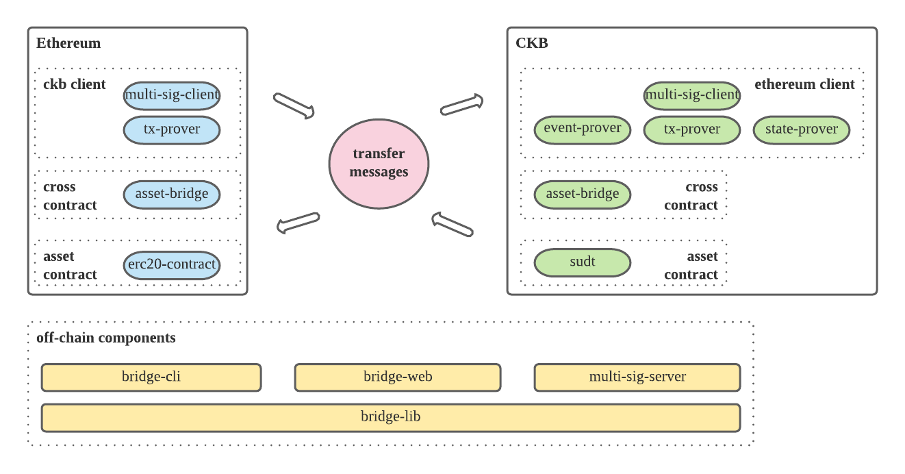

# A Brief Introduction to Force Bridge ETH

Force bridge is a bridge which connects CKB with other blockchain systems( aka cross-chain protocol ).

Force-Bridge-ETH is the Ethereum component. Messages consist of transactions、events and states on Ethereum can be transferred to CKB. In reverse, messages about transactions on CKB can be transferred to Ethereum. 

In other words, dapps on two sides can interoperate with each other based on force-bridge-eth.

In the remaining part of this document, we will refer force-bridge-eth as force bridge for simplification.

## Design

Cross-chain refers to the credible communication between blockchains. Generally, cross-chain protocols need solve two problems:

1. The credibility of cross-chain messages, that is, the authenticity of the message can be verified.
2. The comprehensibility of cross-chain messages, that is, messages can be decoded by another party.

For the first problem, force bridge maintains light clients in smart contracts on both chain and use light clients to verify that transactions or events did happened on the counter party chain. The concept of on-chain light client is similar to [lightweight node](https://en.bitcoin.it/wiki/Lightweight_node) on BTC. And we use a mechanism called [SPV ( Simplified Payment Verification )](https://en.bitcoinwiki.org/wiki/Simplified_Payment_Verification_) to accomplish the verification.

At the first stage, force bridge will maintain the light client in multi-signature notary scheme. A committee consists of Nervos Foundation and the community members will submit headers to the light client, along with their signature.

At the second stage, force bridge will replace the multi-sig-light-client with consensus-based-light-client. It will be a full decentralized way. Everyone can submit headers. The contract will verify the header with the consensus algorithm of the chain.

For the second problem, CKB uses [molecule](https://github.com/nervosnetwork/rfcs/blob/master/rfcs/0008-serialization/0008-serialization.md) for serialization and [blake2b](https://www.blake2.net/) for hashing, corresponding to [rlp](https://eth.wiki/fundamentals/rlp) and keccak256 on Ethereum. So we developed molecule and blake2b library on Ethereum to decode messages from CKB, rlp and keccak256 library on CKB to decode messages from Ethereum.

Thereafter, we can transfer messages between CKB and Ethereum. 

### Ethereum to CKB

The Ethereum header contains state/transaction/receipt root, so messages of these three kinds can be transferred and verified.

Take assets transfer as an example:

1. We can lock ETH/ERC20 token in an asset bridge contract with events emitted on Ethereum.
2. Then transfer the receipt message to CKB, that is to say, construct a CKB transaction with receipt and merkle proof as witness.
3. The constructed CKB transaction will mint mirror asset after verify the message by Ethereum client.

### CKB to Ethereum

The CKB header contains transaction merkle root, so messages of CKB transaction can be transferred and verified.

Take assets transfer as an example:

1. We can burn SUDT ( Simple User Defined Token ) on CKB.
2. Then transfer the transaction message to Ethereum, that is to say, call unlock method of the asset bridge contract with transaction data and merkle proof.
3. The asset bridge contract will unlock the correct asset after verify the message by CKB client.

## Architecture

Force-bridge-eth will support assets transfer natively, the system consists of on-chain contracts and off-chain components.

On-chain:

- Ethereum contracts ( solidity )
  - [CKB light client](https://github.com/nervosnetwork/force-bridge-eth/blob/main/eth-contracts/contracts/CKBChain.sol)
  - cross-chain contract
    - [asset-bridge](https://github.com/nervosnetwork/force-bridge-eth/blob/main/eth-contracts/contracts/TokenLocker.sol): supports lock/unlock asset features
- ckb contracts ( rust )
  - Ethereum light client
  - cross-chain contract
    - asset-bridge: supports mint/burn asset features
        - [bridge-lockscript](https://github.com/nervosnetwork/force-bridge-eth/tree/main/ckb-contracts/contracts/eth-bridge-lockscript): supports mint asset feature
        - [recipient-typescript](https://github.com/nervosnetwork/force-bridge-eth/blob/main/ckb-contracts/contracts/eth-recipient-typescript), supports burn asset feature
 
Off-chain:

- bridge lib ( rust )
  - construct force-bridge-eth related transacitons to ckb and ethereum
  - construct cross-chain message proof
  - common structures and functions
- bridge cli ( rust )
  - depends on bridge lib
  - used by developers to do [deploy, test, bridge actions]
- bridge web ( frontend: js, backend: rust )
  - depends on bridge lib
  - used by users to do asset bridge actions 
- multi-sig-server ( rust )
  - depends on bridge lib
  - used by signers to maintain ckb/ethereum clients
